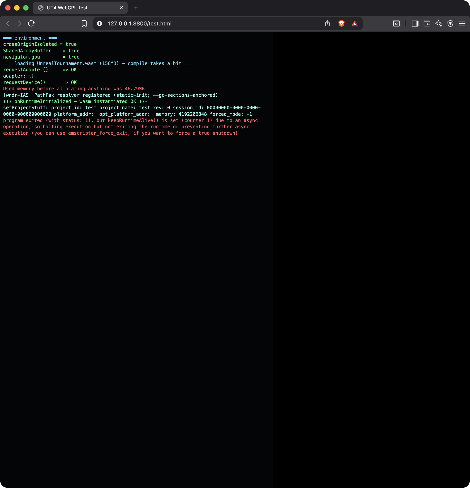

# UT4 on WebGPU

Building **Unreal Tournament (UT4), ported to Unreal Engine 5.8**, to a **WebAssembly + WebGPU** client that runs in a browser tab — using **only open-source Emscripten**, no proprietary/patched toolchain.

## TL;DR — what's proven

The full **build path is 100% open and verified end-to-end.** The UT4 engine *and the actual game* compile and link to a WebGPU `.wasm` with **stock upstream Emscripten**, and the result **downloads, compiles, instantiates, and initializes a WebGPU device in a stock browser** (Chrome / Brave / Edge 113+), running the engine's own C++ — with **zero** dependence on a vendor-patched Emscripten SDK.

| Stage | Result |
|---|---|
| Build wasm third-party libs (blake3…oodle) w/ stock emcc | ✅ open |
| Stock `wasm-ld` links the precompiled WebGPU RHI objects | ✅ open — no ABI lock |
| Full UE5.8 engine → wasm (440 modules) | ✅ 0 errors |
| **UT4 *game* → wasm** (`UnrealTournament.wasm`, 178 MB) | ✅ links, boots |
| Browser: instantiate + WebGPU adapter + device | ✅ confirmed (see `docs/`) |
| **Cook a playable map** (WGSL shader-format tool) | ⛔ **one genuine proprietary gate** — see below |



*The console overlay is live: `crossOriginIsolated`, `SharedArrayBuffer`, `navigator.gpu`, `requestAdapter`/`requestDevice` all OK, wasm instantiated, engine C++ running. It exits `status 1` only because there is no cooked map to load (the bare/content-less build).*

## The one gate (honest)

Producing a **playable cooked map** requires the host **`WebGPUShaderFormat`** tool, which compiles the game's shaders to **WGSL** at cook time. On the UE5.8-Linux branch this module's core — the `IShaderFormat` entry and the **SPIR-V→WGSL emitter** — is **provisioned-only** (present as prebuilt output for licensees; the source was never committed on any accessible branch). Its *libraries* are all present (ShaderConductor/DXC for HLSL→SPIR-V, Tint for SPIR-V→WGSL), but the module glue + emitter — and the contract with the closed WebGPU RHI — are not. So a playable map needs either that provisioned tool, or a from-scratch shader-format matching the closed RHI. **Everything up to shader compilation is solved and open.**

> Note: an earlier suspected gate — the "patched emsdk" — turned out **not** to be required; stock Emscripten builds everything and links the precompiled WebGPU objects with no ABI lock. The shader-format is the *only* genuinely gated input.

## The open recipe

See **[RECIPE.md](RECIPE.md)** for the exact, reproducible steps (clone → build → bundle → run). The load-bearing bits:

1. `-Wno-error` (absorb a stock-clang-vs-vendor-clang warning delta) — the *only* engine compile barrier.
2. Wasm **memory64** end-to-end (`-sMEMORY64=2`) to match the precompiled platform objects.
3. Inject the shipped precompiled platform objects (WebGPU RHI, emdawn, JS glue) into the link.
4. **`-sDEFAULT_TO_CXX`** — the key link fix (stock emcc links no libc++ under `-fno-exceptions + MEMORY64` in C-mode; this auto-links the correct `libc++-mt-noexcept` wasm64 variant).
5. For the **UT4 game** specifically: re-enable **`Target.bUsePCHFiles = true`** so UT4's UE4-era (non-IWYU-clean) code gets `SharedPCH.Engine` — clears ~200 missing-engine-type errors at once.

## Run it yourself

The build produces `UnrealTournament.wasm` + `.js` + `.html`. To run the bundle locally:

```sh
python3 host/serve.py 8800 /path/to/bundle    # COOP/COEP + application/wasm
# open host/loader-shim.html (or the bundle) at http://127.0.0.1:8800 in a WebGPU browser
```

`host/loader-shim.html` is a **self-host loader shim**: the vendor's stock `UnrealTournament.html` expects a platform iframe (`window.parent.state`) and won't boot standalone; the shim stubs that, wires a minimal `Module`, and adds a console-capture overlay so you can see instantiation + WebGPU init. `host/serve.py` sends the mandatory `Cross-Origin-Opener-Policy: same-origin` + `Cross-Origin-Embedder-Policy: require-corp` headers and serves `*.wasm` as `application/wasm` (required for SharedArrayBuffer/threads).

## Repo contents

- `RECIPE.md` — reproducible build steps.
- `host/loader-shim.html` — standalone loader + WebGPU/env probe + console overlay.
- `host/serve.py` — COOP/COEP + wasm-MIME static server for local testing.
- `docs/proof-*.png` — browser screenshots of the bare-engine and UT4 wasm initializing WebGPU.

The large `.wasm` bundles are not committed here (they're build artifacts; follow `RECIPE.md` to produce them). This repo holds **only our own tooling and findings** — no vendor engine source or precompiled objects.
